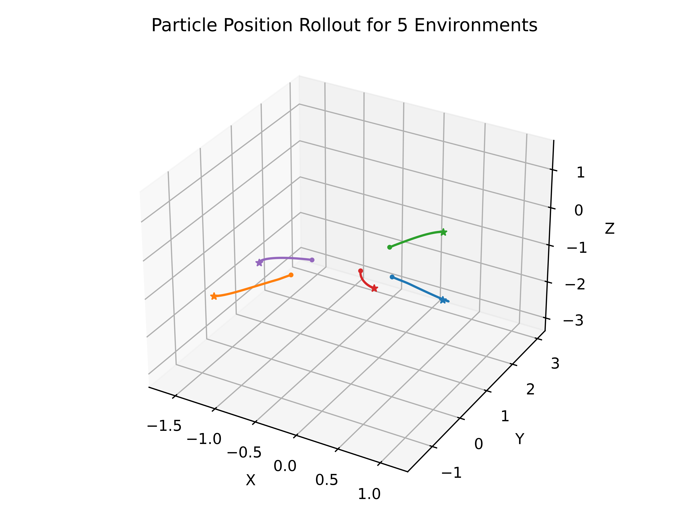

# Point Particle EQ
This respository contains RL environments and PPO training code to investigate equivariance for a point particle. All environments and training code is written using Jax. 

## Installation
This package was run on Python 3.10. Other python versions may work, but it has not been tested. Jax can be installed with backend support for GPU/TPU by following their installation instructions. Training takes approximately 4 mins for 10M env steps, running on an Nvidia RTX A5000. 

```
git clone git@github.com:PratikKunapuli/PointParticleEQ.git
cd PointParticleEQ
pip install jax flax orbax optax distrax gymnax matplotlib numpy
```

## Example Results




## Environments (`jax_envs.py`)
1. PointParticlePosition
`env = PointParticlePosition(equivariant=False)`
This environment represents a single point particle where the actions directly affect the velocity of the particle. The state of the particle is represented as the position and velocity in 3 dimension (x,y,z). Observation is the state of the particle and a reference state (position and velocity), but in this environment the reference velocity is set to be 0. This represents a statically fixed goal. In the equivariant mode, the Gallilean symmetry is employed and the observation is reduced to the error between the reference and state in both position and velocity (6-dim). 

2. PointParticleConstantVelocity
`env = PointParticleConstantVelocity(equivariant=False)`
This environment represents a single point particle where the actions directly affect the velocity of the particle. The state of the particle is represented as the position and velocity in 3 dimension (x,y,z). Observation is the state of the particle and a reference state (position and velocity), as well as the reference acceleration. The reference acceleration is set to be 0 for this environment, resulting in constant velocity of the reference after the reference velocity is randomized in the reset function. Non-equivariant representation is (15-dim) and the equivariant representation is (9-dim) for position error, velocity error, and reference acceleration. 

## Training (`train_policy.py`)
In order to train a policy, we can simply run `python train_policy.py` with some specified arguments. 
``` 
Arguments:
--seed  : Seed to set the jax.random.PRNGkey. Default 0. 
--debug : Flag to print debug info to terminal. 
--no-debug : Flag to not print debug info. This is the default. 
--num-seeds : How many random seeds to train simultaneously. Default is 5. 
--equivariant : Whether to instantiate the environment flag as equivariant. Default without flag is False. 
--exp-name : Name for the experiment. Required.
--env-name : Name for the environment. Required. Options are: "position" for PointParticlePosition env, "constant_velocity" for PointParticleConstantVelocity env. 
```

Examples:
```
python train_policy.py --seed 2024 --equivariant --debug --exp-name PPO_equivariant --env-name position
python train_policy.py --no-debug --exp-name PPO_no_equivariant_seed_0 --env-name constant_velocity
```

### Saved Data
By default, a new directory will be created at `./checkpoints/{exp-name}` and this is where the resulting data generated during training will be saved. This includes the configuration dictionary made from the default parameters and CLI args (`config.txt`), training curves (`training_data.npz`), the final model weights (`/model_final/`) and some figures (`episode_returns_shaded.png`, and `terminal_timesteps_summary.png`). By default, if an experiment name already exists in the `./checkpoints/` directory, a numerical index will be appended and incremented to the experiment name. 

## Evaluations (`eval_policy.py`)
After training a policy, we can evaluate the weights in a new script to simply rollout the environment.
```
Arguments:
--seed : Seed to set the jax.random.PRNGkey. Default 0.
--equivariant : Flag to set the equivariance in the environment. Must match training setup or error will occur. 
--load-path : Path to the model weights we want to evaluate. Required.
--num-envs : How many environemnts to run in parallel. Default 5.
--env-name : Name for the environment. Required. Options are: "position" for PointParticlePosition env, "constant_velocity" for PointParticleConstantVelocity env. 
```

Example:
```
python eval_policy.py --seed 2024 --load-path ./checkpoints/PPO/model_final/ --equivariant --env-name position
```

This script will rollout `{num-envs}` environments and then make a 3D plot representing the rollout of the particles and their respective goals. Additionally, reward curves will be generated for each particle. These figures will be saved in the same parent directly of the weights as `particle_position.png` and `rewards.png`. 
