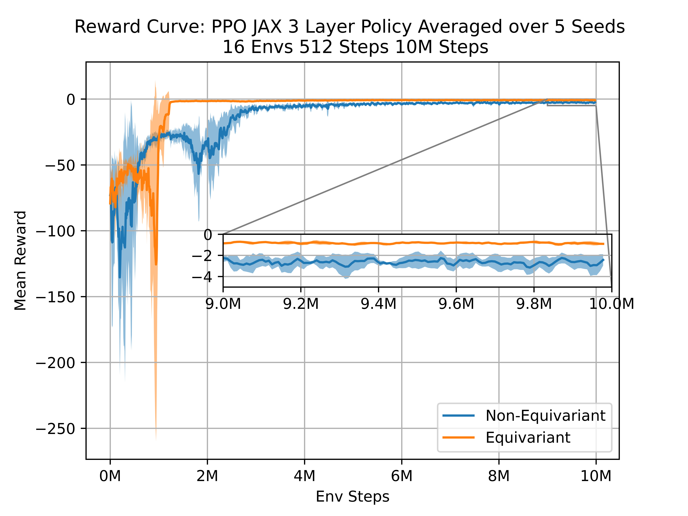

<h1 align="center">
  <b>EQ Tracking Control: Symmetry-Aware Trajectory Tracking Controllers with RL</b><br>
</h1>

<p align="center">
 
</p>

This repository contains code for the environment and RL training implementations of the paper, [Leveraging Symmetry to Accelerate Learning of Trajectory Tracking Controllers for Free-Flying Robotic Systems](https://arxiv.org/abs/2409.11238). All environments are written in Jax, with wrappers available for the standard Gymnasium interface. A custom PPO implementation, also written in Jax, is provided. Training takes approximately 4 mins for 10M env steps, running on an Nvidia RTX A5000. 

## Installation
This package was run on Python 3.10. Other python versions may work, but it has not been tested. Jax can be installed with backend support for GPU/TPU by following their installation instructions. 

```bash
git clone git@github.com:PratikKunapuli/PointParticleEQ.git
cd PointParticleEQ
pip install -r requirements.txt
```

If you would like to use the ROS2 visualizations, ROS2 must be installed seperately. Then, the following line can be used to install the required ROS packages.

```bash
pip install -r requirements_ros2.txt
```

Finally, install the package locally for the relative imports to work
```bash
pip install -e .
```
## Running the code
Example to train and evaluate from scratch:
```bash
## Training
------------
# Particle Env
python3 train_policy.py.py --env-name particle_random_walk_velocity --seed 0 --load-path ./checkpoints/RUN_EXPS_particle_random_walk_p_equivariant/model_final --equivariant 1
python3 train_policy.py.py --env-name particle_random_walk_velocity --seed 0 --load-path ./checkpoints/RUN_EXPS_particle_random_walk/model_final --equivariant 0
python3 train_policy.py.py --env-name particle_random_walk_velocity --seed 0 --load-path ./checkpoints/RUN_EXPS_particle_random_walk_pv_equivariant/model_final --equivariant 3
python3 train_policy.py.py --env-name particle_random_walk_velocity --seed 0 --load-path ./checkpoints/RUN_EXPS_particle_random_walk_pva_equivariant/model_final --equivariant 4
# Astrobee Env
python3 train_policy.py.py --env-name astrobee_random_walk --seed 0 --load-path ./checkpoints/RUN_EXPS_astrobee_random_walk/model_final --equivariant 0 --symmetry_type 2
python3 train_policy.py.py --env-name astrobee_random_walk --seed 0 --load-path ./checkpoints/RUN_EXPS_astrobee_random_walk_equivariant/model_final --equivariant 1 --symmetry_type 2
# Quadrotor Env
python3 train_policy.py.py --env-name quadrotor_random_walk --seed 0 --load-path ./checkpoints/RUN_EXPS_quadrotor_random_walk/model_final --equivariant 0
python3 train_policy.py.py --env-name quadrotor_random_walk --seed 0 --load-path ./checkpoints/RUN_EXPS_quadrotor_random_walk_equivariant/model_final --equivariant 1
------------
## Evaluation
------------
# Particle Env
python3 eval_policy.py --env-name particle_random_walk_velocity --seed 0 --load-path ./checkpoints/RUN_EXPS_particle_random_walk_p_equivariant/model_final --equivariant 1
python3 eval_policy.py --env-name particle_random_walk_velocity --seed 0 --load-path ./checkpoints/RUN_EXPS_particle_random_walk/model_final --equivariant 0
python3 eval_policy.py --env-name particle_random_walk_velocity --seed 0 --load-path ./checkpoints/RUN_EXPS_particle_random_walk_pv_equivariant/model_final --equivariant 3
python3 eval_policy.py --env-name particle_random_walk_velocity --seed 0 --load-path ./checkpoints/RUN_EXPS_particle_random_walk_pva_equivariant/model_final --equivariant 4
# Astrobee Env
python3 eval_policy.py --env-name astrobee_random_walk --seed 0 --load-path ./checkpoints/RUN_EXPS_astrobee_random_walk/model_final --equivariant 0 --symmetry_type 2
python3 eval_policy.py --env-name astrobee_random_walk --seed 0 --load-path ./checkpoints/RUN_EXPS_astrobee_random_walk_equivariant/model_final --equivariant 1 --symmetry_type 2
# Quadrotor Env
python3 eval_policy.py --env-name quadrotor_random_walk --seed 0 --load-path ./checkpoints/RUN_EXPS_quadrotor_random_walk/model_final --equivariant 0
python3 eval_policy.py --env-name quadrotor_random_walk --seed 0 --load-path ./checkpoints/RUN_EXPS_quadrotor_random_walk_equivariant/model_final --equivariant 1
```
A sample script is provided to run on a SLURM cluster:
```bash
cd rl/
sbatch slurm_run_exps.sh
```

## Example Results



## Checkpoints
Pretrained models are provided within the `checkpoints` directory, for all systems. These models match the performance reported in the paper, and the individual hyperparameters used for each experiment are contained wihtin the `config.txt` file of the individual experiments. 

## Citation
If you use this repository or paper please cite the following:
```
@misc{welde2024leveragingsymmetryacceleratelearning,
  title={Leveraging Symmetry to Accelerate Learning of Trajectory Tracking Controllers for Free-Flying Robotic Systems}, 
  author={Jake Welde and Nishanth Rao and Pratik Kunapuli and Dinesh Jayaraman and Vijay Kumar},
  year={2024},
  eprint={2409.11238},
  archivePrefix={arXiv},
  primaryClass={cs.RO},
  url={https://arxiv.org/abs/2409.11238}
}
```
